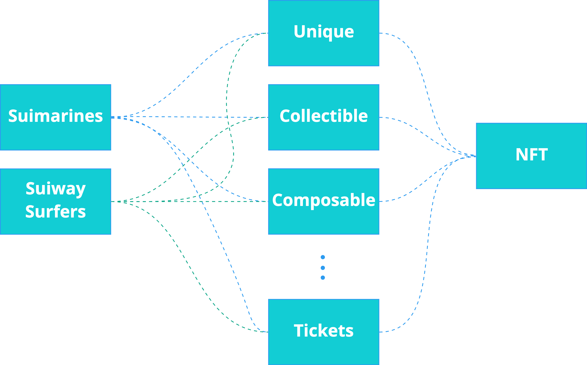

- Sui v0.10.0

# Install

This codebase requires installation of the [Sui CLI](https://docs.sui.io/build/install).

# Built and Test

1. `$ sui move build` to build the available move modules
2. `$ sui move test` to run the move tests
3. `./bin/publish.sh` to publish the modules on localnet or devnet

# OriginByte

A new approach to NFTs.

Origin-Byte is an ecosystem of tools, standards and smart contracts designed to make life easier for Web3 Game Developers and NFT creators. From simple artwork to complex gaming assets, we want to help you reach the public, and provide on-chain market infrastructure.

In Move, the powers of transferability and mutability are commingled, such that only the owner of a single writer object can transfer the object and mutate it within the bounds defined by its module.

Considering the broad range of NFT use cases, there are situations in which we will want NFTs to be mutated by the collection creators (e.g. Upgrading an Art collection; Increasing the damage level of an NFT in-game weapon), even though the NFTs themselves will be owned by users. There are mainly two ways to achieve this:

- The NFT owner can send the NFT to a shared object, to be mutated accordingly
- We can separate the NFT object from its Data object, hence allowing the Data object itself to be shared and mutated accordingly

In the OriginByte protocol, an `NFT` object is a hybrid object that can take two shapes:
- The shape of an NFT that embeds is own data, aka an Embedded NFT; 
- The shape of an NFT which does not embed its own data and contains solely a pointer to its data object, aka a Loose NFT.

This design allows us to keep only one ultimate type while simultaneously allowing the NFT to embed its data or to loosely pointing to it, depending on the use case. It is also possible to dynamically join or split the data object from the NFT object, therefore allowing for arbitrary dynamic behaviour.

The NFT struct is as follows:

```
struct Nft<phantom T, D: store> has key, store {
        id: UID,
        data_id: ID,
        data: Option<D>,
    }
```

By default it contains a pointer to its data object. A loose NFT will have the `data` field empty, in other words `option::none()`, whilst an embedded NFT will have its data object in the `data` field. Using the functions `nft::join_nft_data()` and `nft::split_nft_data()` we can convert back and forth between loose and embedded NFT.
### Embedded NFTs

As stated, embedded NFTs have their data object wrapped within itself. A core difference between embedded and loose NFTs is that, since the embedded NFT forces its data to be wrapped by itself, it can only represent a 1-to-1 relationship with the data object. This is ideal to represent simple collections of unique NFTs such as Art or PFP collections.

In embedded NFTs, the `Data` object and the `NFT` object are minted at the same time, or in other words, in the same entry function call.

The naturally NFT release strategy for embedded NFTs is for the NFT creators to pre-mint them on-chain and transfer them to a Launchpad object, which in turns is responsible to configure the NFT Release / Primary Market Sales strategy.

To mint an embedded NFT, modules will call the function `nft::mint_nft_embedded` which will create the `Data` object as well as the `Nft`.

### Loose NFTs

In contrast, since loose NFTs do not wrap the data object within itself, they can represent 1-to-many relationships between the data object and the NFT objects. Basically, one can mint any amount of NFTs pointing to a single data object. This is ideal to represent digital collectibles, such as digital football or baseball cards, as well as gaming items that more than one user should have access to.

In loose NFTs, the `Data` object is first minted and only then the NFTs associated to that object are minted.

To mint a loose NFT, modules will first create the data object on-chain and then allows the NFTs to be minted on the fly when needed, via the function call `nft::mint_nft_loose`.

### Type Exporting

In the spirit of the design philosophy presented in this [RFC](https://github.com/MystenLabs/sui/blob/a49613a52d1556386464be7d138c379773f35499/sui_programmability/examples/nft_standard/README.md), NFTs of a given NFT Collection have their own type `T` which is expressed as:
- `Nft<T, D>`
- `Collection<T, M, C>`

Where the following generics represent:
- `T` NFT type export that types the `Nft` and `Collection` object
- `D` a generic for the NFT `Data` object type
- `M` a generic for the Collection `Metadta` object type
- `C` a generic for the Collection `Cap` object type

Note: We are considering simplifying the Collection type by removing the generic `C`.
### A 3-layered approach

Since the NFTs are type exported, each NFT collection will have to deploy its type-specific contract that interfaces with OriginByte modules.

Consider two sample NFT collections: Suimarines and Suiway Surfers. To launch these collections on Sui, the creators will deploy the contracts `suimarines` and `suiway_surfers` (this deployment will in the future be made via an OriginByte SDK). Creators will be able to choose which NFT implementation they want their collection to have (i.e. Unique NFTs, Collectibles, Composable NFTs, Tickets, Loyalty Points, etc.):



The core vision is that any developer can build a custom implementation on top of the base NFT contract. Currently we have implemented the following domain-specific modules:
- `nft_protocol::unique_nft`
- `nft_protocol::collectibles`
- `nft_protocol::c_nft`

These domain-specific modules in turn communicate with the base module `nft_protocol::nft` to mint the NFTs and to perform basic actions such as morphing the NFT from loose to embedded and vice-versa.

### Relationship to Collection object
Conceptually, we can think of NFTs being organized into collections. It is in essence a 1-to-many relational data model, that could, in a traditional database setup, be represented by two relational database tables, `collection` and `nfts`, where `collection_id` would serve as a primary key for the `collection` table and a foreign key to the `nfts` table.

In Move, the way we represent this relational model is to guarantee that the NFT objects themselves have an `ID` pointer to the collection `UID`.

To mint an NFT, projects must first create the NFT collection object, where metadata and configurations about the project will be stored. The NFT collection objects are meant to be owned by the project owners, who maintain control over the collection and its NFTs while the collection is mutable (TODO: We should separate the concept of Freezing the Collection and inherent mutability of its NFTS).

At any point in time, the collection owner can decide to make the collection immutable, which involves freezing the collection object and its associated NFTs. However, not all fields of the Collection are frozen:

- The field current_supply will still mutate every time an NFT is minted or burned
- Collection owners will still be able to push and pop tags onto the field tags

When minting an NFT, you need to pass on a mutable reference to the Collection object. This means that only the collection owner can perform the initial mint, unless it is a shared-object in which case anyone can.

## Data Model

### Collection

The collection object, `Collection<phantom T, M: store, C: store>`, has the following data model:

| Field            | Type          | Description |
| ---------------- | ------------- | ----------- |
| `id`             | `UID`         | The UID of the collection object |
| `name`           | `String`      | The name of the collection |
| `description`    | `String`      | The name of the collection |
| `symbol`         | `String`      | The symbol/ticker of the collection |
| `receiver`       | `address`     | Address that receives the mint price in Sui |
| `tags`           | `Tags`        | A set of strings that categorize the domain in which the NFT operates |
| `is_mutable`     | `bool`        | A configuration field that dictates whether NFTs are mutable |
| `royalty_fee_bps` | `u64`             | The royalty fees creators accumulate on the sale of NFTs * |
| `creators`        | `vector<Creator>` | A vector containing the information of the creators |
| `metadata`       | `M`        | A generic type representing the metadata object embedded in the NFT collection |
| `cap` | `C`         | A generic type refering to the Supply Policy of the collection |

* `royalty_fee_bps` is currently not being utilized but will be used in the standard launchpad module.

Where `Tags` is a struct with the field `enumerations` as a `VecMap<u64, String>` being the set of strings representing the domains of the NFT (e.g. Art, Gaming Asset, Tickets, Loyalty Points, etc.)

Where `Creators` is a struct with the following fields:
- `id` representing the address of the creator
- `verified` which is a bool value that represents if the creator address has been verified via signed transaction (this functionality is still not implemented)
- `share_of_royalty` as the percentage share that the creator has over `royalty_fee_bps`.

The collection object has the following functions that mutate state:

- `mint_capped` which mints a collection object with capped supply and returns it
- `mint_uncapped` which mints a collection object with unlimited supply and returns it
- `increase_supply` which increments `current_supply` by one 
- `decrease_supply` which decreases `current_supply` by one
- `burn` which burns the collection object if `current_supply` is zero

and the following modifier functions:
- `freeze_collection` (irreversible)
- `rename`
- `change_description`
- `change_symbol`
- `change_receiver`
- `push_tag`
- `pop_tag`
- `change_royalty` changes the field `royalty_fee_bps`
- `add_creator` pushes a `Creator` to the `creators` field
- `remove_creator` pops a `Creator` from the `creators` field
- `cap_supply`: `Limited` collections can have a cap on the maximum supply, however the supply cap can also be `option::none()`. This function call adds a value to the supply cap.
- `increase_supply_cap`
- decrease_supply_cap

### Standard Collection Metadata

The standard collection metadata object, `CollectionMeta`, has the following data model:

| Field             | Type              | Description |
| ----------------- | ----------------- | ----------- |
| `id`              | `UID`             | The UID of the standard collection metadata object |
| `json`            | `String`          | An open string field to add any arbitrary data |

The collection metadata object has the following functions that mutate state:

- `mint_and_transfer` mints a collection object, it's corresponding metadata object, and transfers it to a recipient
- `mint_and_share` mints a collection object, it's corresponding metadata object, and makes it a shared object
- `burn_limited_collection` which burns the limited collection object and subsequently the metadata object if the NFT supply is zero.

### NFT (Base type)

Generic NFT object, `Nft<phantom T, D: store>`, has the following data model:

| Field             | Type              | Description |
| ----------------- | ----------------- | ----------- |
| `id`              | `UID`             | The UID of the generic NFT object |
| `data_id`         | `ID`              | A pointer to the collection object |
| `data`            | `Option<D>`       | An optional generic type representing the data object embedded in the NFT |

The generic NFT object has the following functions to be called by an upstream contract:
- `mint_nft_loose` to mint a loose NFT
- `mint_nft_embedded` to mint an embedded NFT
- `join_nft_data` to turn a loose NFT to embedded NFT
- `split_nft_data` to turn an embedded NFT to loose
- `burn_loose_nft` to burn a loose NFT
- `burn_embedded_nft` to burn an embedded NFT

### Unique NFT (Embedded)

Unite NFT data object, `Unique`, has the following data model:

| Field             | Type              | Description |
| ----------------- | ----------------- | ----------- |
| `id`              | `UID`             | The UID of the NFT metadata object |
| `index`           | `u64`             | The index of the NFT in relation to the whole collection |
| `name`            | `String`          | Name of the NFT object |
| `description`     | `String`          | Description of the NFT object |
| `collection_id`   | `ID`              | ID pointer to Collection object |
| `url`             | `Url`             | The URL of the NFT |
| `attributes`      | `Attributes`      | Attributes of a given NFT |

Where `Attributes` is a struct with the field `keys`, the attribute keys represented as string vector, in other words the set of traits (e.g. Hat, Color of T-shirt, Fur type, etc.) and NFT has, and `values` of such traits (e.g. Straw Hat, White T-shirt, Blue Fur, etc.).

The NFT metadata object has the following functions:
- `launchpad_mint_unlimited_collection_nft ` to mint an NFT from an unlimited collection and transfer it to the launchpad object
- `launchpad_mint_limited_collection_nft` to mint an NFT from a limited collection and transfer it to the launchpad object
- `direct_mint_unlimited_collection_nft` to mint an NFT from an unlimited collection and transfer it directly to a user address
- `direct_mint_limited_collection_nft` to mint an NFT from a limited collection and transfer it directly to a user address
- `burn_nft` to burn an NFT


### Collectibles NFT (Loose)

Collectible NFT data object, `Collectible`, has the following data model:

| Field             | Type              | Description |
| ----------------- | ----------------- | ----------- |
| `id`              | `UID`             | The UID of the NFT metadata object |
| `index`           | `u64`             | The index of the NFT in relation to the whole collection |
| `url`             | `Url`             | The URL of the NFT |
| `attributes`      | `Attributes`      | Attributes of a given NFT |
| `supply`          | `Supply`          | Object determining Supply limit of the NFT |

Where `Attributes` is a struct with the field `keys`, the attribute keys represented as string vector, in other words the set of traits (e.g. Hat, Color of T-shirt, Fur type, etc.) and NFT has, and `values` of such traits (e.g. Straw Hat, White T-shirt, Blue Fur, etc.).

The NFT metadata object has the following functions:
- `mint_unlimited_collection_nft_data` to create the data object associated to a NFT from an unlimited collection
- `mint_limited_collection_nft_data` to create the data object associated to a NFT from a limited collection
- `mint_nft` to mint an NFT and transfer it to user (to be called from the launchpad module)
- `burn_limited_collection_nft_data` to destroy a given NFT data if the supply is zero
- `burn_nft` to burn an NFT


### Composable cNFTs (Loose)

- `name`
- `index`
- `url`
- `attributes`

### Slingshot Launchpad

The Slingshot object, `Slingshot<phantom T, M>`, has the following data model:

| Field             | Type              | Description |
| ----------------- | ----------------- | ----------- |
| `id`              | `UID`             | The UID of the Slingshot object |
| `collection_id`   | `ID`              | The ID of the NFT Collection object |
| `live`            | `bool`            | Boolean indicating if the sale is live |
| `admin`           | `address`         | The address of the administrator |
| `receiver`        | `address`         | The address of the receiver of funds |
| `sales`           | `vector<Sale<T, M>>`      | Vector of all Sale outleds that, each outles holding IDs owned by the slingshot |
| `is_embedded`     | `bool`          | Field determining if NFTs are embedded or loose |

It has the following init and drop functions:
- `create` to create the Slingshot launchpad (called by the market module)
- `delete` to destroy the Slingshot launchpad (called by the market module) 

### Fixed Price Market

The Fixed Price Market object, `Market`, has the following data model:

| Field             | Type              | Description |
| ----------------- | ----------------- | ----------- |
| `id`              | `UID`             | The UID of the Slingshot object |
| `price`           | `u64`             | The price of a NFT for sale in SUI |

It has the following init and drop functions:
- `create_single_market` to create a Single Fixed Price Market launchpad with option for whitelisting rules
- `create_multi_market` to create a Fixed Price Market launchpad with tiered sales, in that NFTs to be sold can be seggregated by sales outlets, each with different prices and different options for whitelisting rules
- `buy_nft_certificate` to buy an NFT certificate from a permissionless Sales outlet
- `buy_whitelisted_nft_certificate` to buy an NFT certificate from a whitelisted Sales outlet
- `claim_nft_embedded` to redeem an embedded NFT by burning the NFT certificate
- `claim_nft_loose` to redeem a loose NFT by burning the NFT certificate
- `new_price` to be called by the launchpad administrator to change the price of the sale


## Guides for NFT Creators, Wallets and Marketplaces

Note: This section needs to be developed.

### Deploy a simple NFT collection

The deployment of NFT collections can be customised extensivelly, nevertheless we present a summary on how the deployment looks like for a simple collection.

Deploy type-specific `<T>` module that calls:
  - Standard Collection implementation:
     - `std_collection::mint_and_transfer<T>` to create the collection and transfer it to the NFT creator
   - Fixe Price NFT Release:
     - `fixed_price::create_single_market<T>`
   - Unique NFT implementation:
    - `unique::launchpad_mint_limited_collection_nft<T>` to mint an NFT and add it to the launchpad (1 call per each NFT)

To buy an NFT from the Collection at the initial sale:
- `fixed_price::buy_nft_certificate` to buy a `NftCertificate` which tells you which NFT you can redeem
- `fixed_price::claim_nft_embedded` to burn the `NftCertificate` and redeem the `Nft`


Note: We currently use the intermediary object `NftCertificate` since we cannot dynamically fetch child objects, however this will change in the future when this feature is added.
