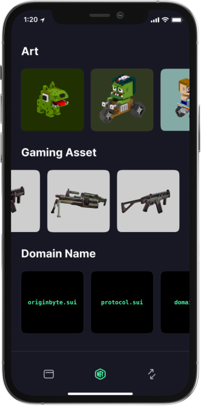

# Display RFC

As part of the Roundtable session held on `January 19th 2023`, we intend to bootstrap the discussion around display standards in a post dynamic-object fields world.

In the previous RFC, the display standard was organised in:

- A set of (field name, type) pairs with a spacial interpretation on the client-side.

| Field Name | Move type | Description |
| --- | --- | --- |
| name | std::string::String, std::ascii::String | Name of the NFT. Shown at the top of the NFT view |
| description | std::string::String, std::ascii::String | Description of the NFT. Shown in the NFT properties view. |
| url | sui::url::Url, sui::url::UrlCommitment, vector<sui::url::Url>, vector<sui::url::UrlCommitment> | URL containing the content for an NFT, or a vector containing several such URLs. If the URL contains an image, it will be displayed on the left of the NFT view |

- A set of types with a special display interpretation on the client side

| Move type | Description |
| --- | --- |
| std::string::String, std::ascii::String | Displayed as a UTF8-encoded string for std::string::String or a vector if the underlying bytes are not valid ASCII., and an ASCII-encoded string for std::ascii::String. Displayed as a vector |
| sui::url::Url, sui::url::UrlCommitment | Displayed as a clickable hyperlink |
| sui::object::ID, |  |
| sui::object::UID | Displayed in hex with a leading 0x (e.g., 0xabc..), with a clickable hyperlink to the object view page in the Sui explorer |
| std::option::Option | Displayed as None if the Option does not contain a value, and Some(_) with display rules applied to the contents if the Option contains a value. |

### Dynamic Object Fields

This RFC proposes to expand display standards to leverage on the feature of dynamic object fields. The core idea is that the fields mentioned above should not be required to be present in the root level object but can be in a dynamic object field immediately attached to the root-level object.

In summary, when a UI fetches a given object; it fetches its dynamic object fields. If any of the fields with spatial interpretation are found in the root object or its in its dynamic object fields it will then be displayed. If a given field exists both in the root-level object and as a dynamic object field, then the root-level field is prioritised.

### Tags

We propose a tag system that allows for Wallets to organise their NFT display by categories. Wallets can query NFTs and check if they have a field tags in the root-level or as a dynamic field, to figure out what the business domain of each NFT is.

Currently, we have considered the following Tags:

- Art
- ProfilePicture
- Collectible
- GameAsset
- TokenisedAsset
- Tickers
- Ticker
- DomainName
- Music
- Video
- Ticket
- License

### Composable URLs

There are three main ways of displaying Composable NFTs:

1. UIs render the images in separately;
2. When merging NFTs together, an off-chain oracle deploys the combined image to IPFS and updates the main URL of the composable NFT;
3. UI’s dynamically render the images based on a list or URL, stacking the png images on top of each other

The first option delivers poor user experience to the user. The second option introduces centralisation as oracles are likely to be controlled by creators or some third-party platform. As such, we believe the third option is the most viable solution. It relies on consensus implementation, is  lightweight and guarantees the desired UX.
